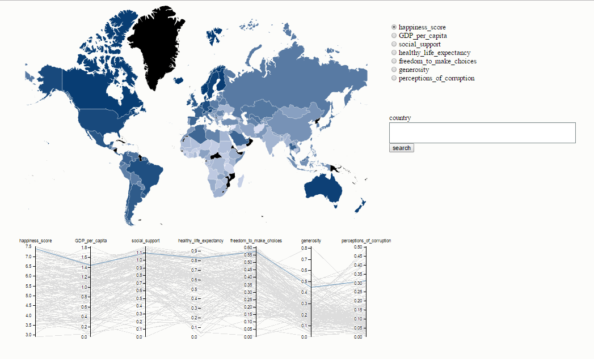

# WORLD-HAPPINESS-REPORT

<h3> The world happiness report is a survey in almost all the countries of the world, which measures the happiness of people in that country, this score is divided into several indexes that explain it, such as corruption, or life expectancy. The project consists in making a visualization of the data of the world happiness report, understandable and interactive, striking for the users, who are common people who want to explore the report, either for entertainment or for research.</h3>
